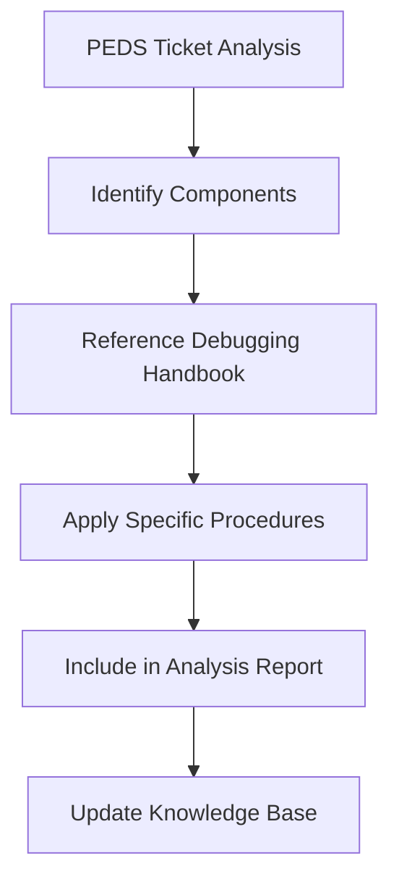

# Smartech QA Debugging Handbook 🔧

> **Source**: Confluence - [Smartech QA Debugging Handbook](https://netcoresolutions.atlassian.net/wiki/spaces/SE/pages/3215425537/Smartech+QA+Debugging+Handbook)
> 
> **Purpose**: Comprehensive debugging reference for QA team testing across all Netcore components
> 
> **Usage**: Referenced automatically in PEDS analysis for component-specific debugging guidance

## 📋 Overview

This handbook serves as the definitive reference for debugging and testing procedures across all Smartech components. It provides step-by-step guidance for QA engineers when investigating issues in various product areas.

## 🎯 Integration with PEDS Analysis

This handbook is automatically referenced during PEDS ticket analysis to provide:
- **Component-specific debugging steps** for issues
- **Testing procedures** for verification
- **Common troubleshooting patterns** for similar issues
- **Environment-specific considerations** for debugging

---

## 🔧 QA Tools & Environment Setup

### 🛠️ Essential QA Tools
- **Must have tools for QA engineers** - Core debugging toolkit and environment setup

### 🏗️ Architecture Understanding
- **Debugging and Understanding Architecture** - System architecture overview for effective debugging

### 🔍 Environment & Access
- **Read Only access to JENKINS, Kibana, Grafana, ConfigHub, ArgoCD, AWS Account and Environment Details for components**
- **Information of Config Hub and Docker Container Applications**

---

## 🌐 Platform & POD Debugging

### 🖥️ Web Platform Debugging
- **Web POD Debugging Steps** - Comprehensive web platform troubleshooting

### 📱 Mobile Platform Debugging  
- **App POD Debugging Steps** - Mobile app debugging and troubleshooting procedures

### 🔄 Infrastructure Debugging
- **POD1 POD2 and POD3 redis ports** - Redis configuration and debugging across environments
- **Master and Feature Branches on POD2 with Multiple Instances of the Same Component**

---

## 🔍 Core Component Debugging

### 📧 Email Campaign Management
- **Email Broadcast Debugging** - Email delivery and campaign troubleshooting
- **Debugging Campaign API for Email** - API-level email debugging
- **Debugging AMP for Email** - AMP email template debugging
- **Debug SPAM and BOUNCE Email** - Email deliverability issues

### 📱 SMS & Messaging
- **SMS Broadcast Debugging** - SMS delivery and configuration issues
- **Whatsapp Integration details with CEE and CPAAS** - WhatsApp channel debugging
- **Debugging Viber Integration details with CEE and InfoBip** - Viber channel troubleshooting

### 🔔 Push Notifications
- **How to debug Geofence APN?** - Location-based push notification debugging
- **Debug APN 100X Campaign?** - Advanced push notification campaigns
- **Debug Java PNServer** - Push notification server debugging

### 🎯 Journey & Automation
- **Journey Debugging** - Customer journey flow troubleshooting
- **Debug Merchandising Trigger Journey - QA Help Document** - Merchandising automation debugging

---

## 🗄️ Database & Data Management

### 🐘 Vertica Database
- **Debug and Use Vertica DB** - Vertica database debugging and querying
- **How to find table name, list id, Segmentid from Vertica DB?** - Data location and structure
- **Debug API built on top of VerticaDB** - Vertica API troubleshooting
- **How Vertica Migration Script works for migrating Data from MySQL to VerticaDB?**
- **How to use Vertica Migration scripts?**
- **Debug Vertica Contact Reachability** - Contact data validation

### 🗃️ MySQL Database
- **Debug and Use MySQL DB** - MySQL database debugging procedures

### 🍃 MongoDB
- **How to debug MongoDB issues (Client Mongo and DMONGO)** - MongoDB troubleshooting

### 🔶 Cassandra
- **How to debug Cassandra DB?** - Cassandra database debugging

### 📊 Redis
- **Debug Client Panel, PRAPP, Mongo information via MMAIL and REDIS** - Redis debugging
- **Debugging Redis Overflow Script** - Redis memory management

---

## 👥 Audience & Segmentation

### 🎯 Segment Management
- **Segment Debugging Steps** - Audience segmentation troubleshooting
- **Debug if User is present in Segment and List for App and Web** - User membership validation
- **How to delete Segment Lock for a Panel?** - Segment lock management

### 🔄 Data Processing
- **AutoDiscovery Debugging Steps** - Automated audience discovery
- **Latebinding Debugging Steps** - Dynamic audience binding
- **How to Debug Bulk Contact Uploads?** - Contact import troubleshooting

### 🤖 Advanced Segmentation  
- **How to debug SAS Manager and goLambdaAudienceSelector (SaSv2 Lambda)?** - Advanced audience selection

---

## 🔌 API & Integration Debugging

### 🌐 API Debugging
- **JSON API Debugging with sample API call for POD2** - API testing and validation
- **Debug APIv1v2v3v4** - Multi-version API debugging
- **S2S Activity API (Server to Server Activity API)** - Server-to-server integration

### 🔗 Third-party Integrations
- **How to Debug Shopify Integration with CEE?** - E-commerce platform integration
- **FB custom audience Credentials and Steps** - Facebook integration debugging

### 📂 File Transfer
- **Debugging FTP or SFTP feature** - File transfer protocol debugging
- **File Upload on Web Server for Testing** - File upload troubleshooting

---

## ⚡ Lambda & Serverless

### 🚀 Lambda Functions
- **Lambda Debugging Steps** - AWS Lambda function debugging
- **How to Debug Event Logger?** - Event processing and logging

### 🔄 Scheduled Tasks
- **How to debug Conversion or Raman Scheduler?** - Scheduled job debugging
- **SRE Automated Tasks** - Automated system tasks

---

## 📊 Analytics & Reporting

### 📈 Analytics Debugging
- **Debug Conversion and Revenue for IA2.0** - Conversion tracking and revenue attribution
- **Debugging Download Reports (Direct Download, LocalSTM, RemoteSTM)** - Report generation
- **Debug MAU (Monthly Active Users)** - User analytics validation

### 🔍 Event Tracking
- **How to debug Event Consumption tracking?** - Event data pipeline debugging

### 🎯 Attribution & ML
- **Debugging MLAI on CEE Smartech** - Machine learning and AI debugging

---

## 🔐 Security & Access Management

### 🛡️ Authentication
- **How to debug secure ip login?** - IP-based security debugging
- **Debug RBAC** - Role-based access control debugging

### 🔑 Panel Management
- **How to retrieve Report Password for panel** - Panel access management
- **Debugging of demo panel functionality** - Demo environment setup

---

## 🏗️ Infrastructure & DevOps

### 📦 Container Management
- **Information of Config Hub and Docker Container Applications** - Container debugging

### 🔄 Data Migration
- **Debugging steps for ProdToPreProd** - Environment data migration
- **How to debug Datamasking?** - Data privacy and masking

### 💾 Backup & Recovery
- **Database Backup and Restore Information** - Data backup procedures

---

## 📊 Monitoring & Observability

### 📊 Monitoring Tools
- **DataDog - Monitoring tool** - Application performance monitoring

### 🔍 Debugging Utilities
- **What is TRID and how to debug using TRID?** - Transaction ID debugging
- **Debugging of MGGenerator** - Message generation debugging
- **LSLoader Debugging** - List loading debugging

---

## 🎮 Specialized Features

### 💬 Chat & Communication
- **Debug Limechat** - Chat feature debugging
- **CEE CPAAS RCS Panel** - Rich Communication Services

### 🎮 Gaming & Engagement
- **How to debug GCM (Google Contact Manager)?** - Google integration debugging

### 🏷️ Content Management
- **How to delete attributes, increase attribute limit AND increase activity limit?** - Content management debugging
- **How to debug Harvest Error OR perform Clean Upload?** - Content harvesting

---

## 🔄 Integration Guidelines for PEDS Analysis

### 🎯 Component Mapping
When analyzing PEDS tickets, this handbook provides:

1. **Component Identification**: Map ticket components to debugging sections
2. **Procedure Selection**: Choose appropriate debugging steps based on issue type
3. **Testing Verification**: Use handbook procedures to verify fixes
4. **Knowledge Transfer**: Reference relevant sections in analysis reports

### 🔄 Analysis Enhancement Workflow

### 📋 Analysis Template Integration

Each PEDS analysis should include:
- **Debugging Guidance**: Relevant handbook sections
- **Testing Procedures**: Step-by-step validation steps
- **Common Patterns**: Similar issues and solutions
- **Prevention Steps**: How to avoid similar issues

---

## 🔄 Content Update Process

**Status**: ✅ **Updated from Confluence** - Current as of latest sync

### Sections Available:
- ✅ 60+ debugging procedures documented
- ✅ Component-specific troubleshooting guides
- ✅ Database debugging procedures
- ✅ API and integration debugging
- ✅ Infrastructure and DevOps procedures

### Update Triggers:
- When Confluence content is updated
- After significant product changes
- Based on new debugging patterns discovered
- Following QA process improvements

---

## 📞 Support & Resources

### 🆘 Escalation Contacts
Each debugging section includes specific escalation paths to:
- Component-specific subject matter experts
- On-call engineering contacts
- Product team liaisons

### 🔗 Related Documentation
- [Netcore Jira Reference](../netcore-platform/netcore_jira_reference.md)
- [PEDS Analysis Patterns](../../analysis-patterns/)
- [Component Impact Matrix](../../defect-knowledge/component-impact-matrix.md)

---

*This handbook is automatically referenced during PEDS analysis to provide context-aware debugging guidance for more effective issue resolution.* 

**📊 Coverage**: 60+ debugging procedures across all Smartech components
**🔄 Last Updated**: Synced from Confluence
**🎯 Usage**: Integrated with automated PEDS analysis workflow 