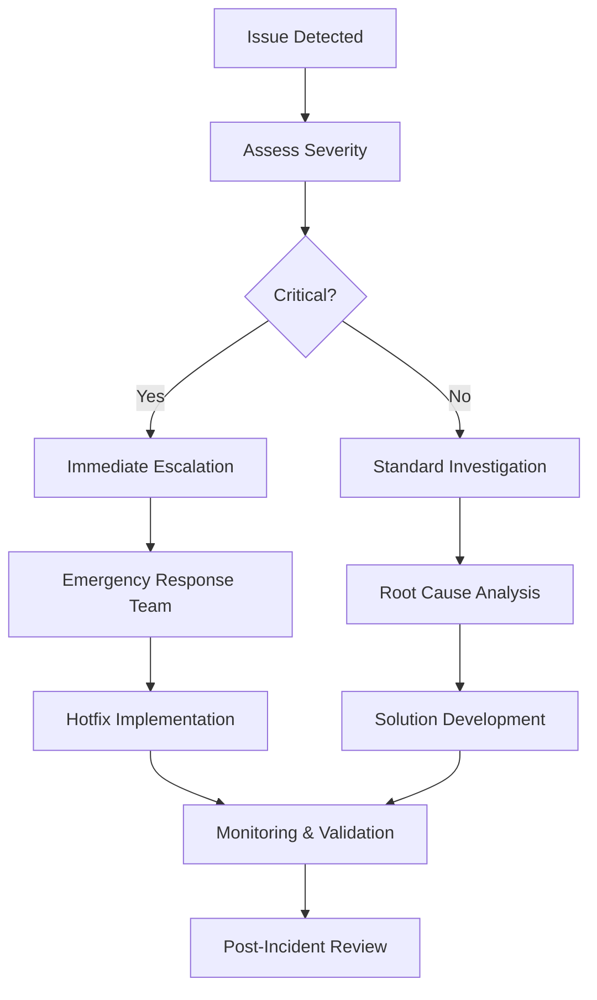

# Common Issues & Defect Patterns - Netcore Cloud Platform

## Overview
This document catalogs frequent defect patterns, common issues, root causes, and proven resolution strategies encountered in the Netcore Cloud platform. It serves as a knowledge base for faster troubleshooting and proactive issue prevention.

## Issue Categories

### 1. Campaign & Journey Issues

#### Campaign Delivery Failures

**Common Patterns:**
- **Zero Delivery Rate**: Campaign sent but no messages delivered
- **Partial Delivery**: Some messages delivered, others fail silently
- **Delayed Delivery**: Messages delivered hours/days after scheduled time
- **Duplicate Messages**: Recipients receiving multiple copies of same message

**Root Causes & Solutions:**

| Issue | Root Cause | Solution | Prevention |
|-------|------------|----------|------------|
| Zero delivery | Invalid audience segment query | Validate segment logic before sending | Segment preview & testing |
| Zero delivery | Channel API configuration error | Check API keys, endpoints, credentials | Automated configuration validation |
| Partial delivery | Rate limiting by external providers | Implement throttling & retry logic | Monitor provider limits |
| Delayed delivery | Queue backlog in messaging system | Scale processing capacity | Load monitoring & auto-scaling |
| Duplicate messages | Retry logic triggered multiple times | Implement idempotency checks | Unique message IDs & deduplication |

#### Journey Workflow Issues

**Common Patterns:**
- **Users Not Entering Journey**: Triggers not firing correctly
- **Users Stuck in Wait Nodes**: Flow progression halted
- **Incorrect Path Execution**: Users taking wrong journey branches
- **Journey Performance Degradation**: Slow execution times

**Root Causes & Solutions:**

| Issue | Root Cause | Solution | Prevention |
|-------|------------|----------|------------|
| Users not entering | Event tracking misconfiguration | Verify event schema & implementation | Event validation framework |
| Users not entering | Audience criteria too restrictive | Review and adjust segment filters | Segment testing with sample data |
| Users stuck in wait | Time zone configuration errors | Standardize to UTC, handle local time | Centralized time management |
| Incorrect path | Logic condition errors | Test all possible conditions | Decision tree validation |
| Performance issues | Complex audience queries | Optimize segment queries | Query performance monitoring |

### 2. Integration & API Issues

#### SDK Integration Problems

**Common Patterns:**
- **Events Not Tracking**: User actions not captured
- **Profile Updates Failing**: Customer data not syncing
- **SDK Crashes**: Mobile app stability issues
- **Incorrect Attribution**: Event attribution to wrong users

**Root Causes & Solutions:**

| Issue | Root Cause | Solution | Prevention |
|-------|------------|----------|------------|
| Events not tracking | SDK not initialized properly | Follow integration checklist | Automated SDK verification |
| Events not tracking | Network connectivity issues | Implement offline event queuing | Connectivity handling |
| Profile updates failing | Data validation errors | Validate data before sending | Client-side validation |
| SDK crashes | Memory leaks in SDK | Update to latest SDK version | Regular SDK updates |
| Incorrect attribution | User ID mapping issues | Implement proper user identification | User ID validation framework |

#### API Integration Issues

**Common Patterns:**
- **Authentication Failures**: API calls returning 401/403 errors
- **Rate Limiting**: API calls being throttled
- **Data Format Errors**: Payload validation failures
- **Timeout Issues**: API calls timing out

**Root Causes & Solutions:**

| Issue | Root Cause | Solution | Prevention |
|-------|------------|----------|------------|
| Authentication failures | Expired API keys | Implement key rotation process | Automated key expiry monitoring |
| Authentication failures | Incorrect permissions | Review and update API permissions | Role-based access validation |
| Rate limiting | Exceeding API limits | Implement exponential backoff | API usage monitoring |
| Data format errors | Schema validation failures | Validate payloads before sending | Payload validation framework |
| Timeout issues | Large payload sizes | Implement pagination | Payload size limits |

### 3. Channel-Specific Issues

#### Email Delivery Issues

**Common Patterns:**
- **High Bounce Rates**: Emails not reaching recipients
- **Low Open Rates**: Poor email engagement
- **Spam Folder Delivery**: Emails going to spam/junk
- **Rendering Issues**: Email display problems across clients

**Root Causes & Solutions:**

| Issue | Root Cause | Solution | Prevention |
|-------|------------|----------|------------|
| High bounce rates | Poor email list hygiene | Implement list cleaning process | Regular list validation |
| High bounce rates | Invalid email addresses | Validate emails at collection point | Real-time email validation |
| Low open rates | Poor subject lines | A/B test subject lines | Subject line optimization |
| Spam delivery | Poor sender reputation | Warm up IP addresses | Sender reputation monitoring |
| Rendering issues | HTML/CSS compatibility | Test across email clients | Multi-client testing |

#### SMS Delivery Issues

**Common Patterns:**
- **Delivery Failures**: SMS not reaching recipients
- **Character Encoding Issues**: Special characters not displaying
- **International Delivery Problems**: Issues with global SMS
- **Carrier Filtering**: Messages blocked by carriers

**Root Causes & Solutions:**

| Issue | Root Cause | Solution | Prevention |
|-------|------------|----------|------------|
| Delivery failures | Invalid phone numbers | Validate phone number format | Phone validation service |
| Delivery failures | Carrier issues | Implement multi-vendor routing | Carrier redundancy |
| Character encoding | Unicode handling errors | Use proper encoding (UTF-8) | Character encoding validation |
| International issues | Country-specific regulations | Research local SMS regulations | Compliance checking |
| Carrier filtering | Content flagged as spam | Review message content | Content compliance scanning |

#### Push Notification Issues

**Common Patterns:**
- **Token Management Issues**: Invalid or stale device tokens
- **Delivery Failures**: Notifications not reaching devices
- **Platform-Specific Problems**: iOS vs Android differences
- **Rich Media Issues**: Images/actions not working

**Root Causes & Solutions:**

| Issue | Root Cause | Solution | Prevention |
|-------|------------|----------|------------|
| Token issues | Expired device tokens | Implement token refresh logic | Automated token cleanup |
| Delivery failures | App uninstalled | Monitor uninstall tracking | Uninstall detection |
| Platform differences | OS-specific limitations | Test on both platforms | Cross-platform testing |
| Rich media issues | File size/format limitations | Optimize media files | Media validation |

### 4. Data & Analytics Issues

#### Data Inconsistency Problems

**Common Patterns:**
- **Profile Data Mismatches**: Different data across systems
- **Event Attribution Errors**: Events attributed to wrong users
- **Segmentation Discrepancies**: Audience counts don't match
- **Reporting Inconsistencies**: Different metrics across reports

**Root Causes & Solutions:**

| Issue | Root Cause | Solution | Prevention |
|-------|------------|----------|------------|
| Profile mismatches | Data sync delays | Implement real-time sync | Sync monitoring |
| Profile mismatches | Identity resolution issues | Improve user matching logic | Identity validation |
| Attribution errors | Cookie/session handling | Implement proper session management | Session tracking validation |
| Segmentation issues | Cache invalidation problems | Implement proper cache strategy | Cache monitoring |
| Reporting issues | Data processing delays | Optimize data pipelines | Pipeline monitoring |

#### Performance & Scaling Issues

**Common Patterns:**
- **Slow Query Performance**: Database queries taking too long
- **High Memory Usage**: System memory exhaustion
- **API Response Delays**: Slow API performance
- **Processing Bottlenecks**: System unable to handle load

**Root Causes & Solutions:**

| Issue | Root Cause | Solution | Prevention |
|-------|------------|----------|------------|
| Slow queries | Unoptimized database queries | Add indexes, optimize queries | Query performance monitoring |
| High memory usage | Memory leaks in application | Fix memory leaks, optimize code | Memory profiling |
| API delays | High request volume | Implement caching, load balancing | Performance monitoring |
| Processing bottlenecks | Inadequate resources | Scale infrastructure | Auto-scaling configuration |

### 5. Security & Compliance Issues

#### Authentication & Authorization Problems

**Common Patterns:**
- **Unauthorized Access**: Users accessing restricted features
- **Session Management Issues**: Users getting logged out unexpectedly
- **Permission Escalation**: Users gaining elevated privileges
- **SSO Integration Problems**: Single sign-on failures

**Root Causes & Solutions:**

| Issue | Root Cause | Solution | Prevention |
|-------|------------|----------|------------|
| Unauthorized access | Role permission misconfiguration | Review and update permissions | Regular permission audits |
| Session issues | Session timeout settings | Adjust session parameters | Session monitoring |
| Permission escalation | Privilege inheritance bugs | Fix inheritance logic | Security testing |
| SSO problems | Identity provider changes | Update SSO configuration | SSO monitoring |

#### Data Privacy & GDPR Issues

**Common Patterns:**
- **Data Retention Violations**: Data kept beyond required period
- **Consent Management Issues**: Improper consent handling
- **Data Export Problems**: Unable to provide user data
- **Right to be Forgotten**: Data deletion not complete

**Root Causes & Solutions:**

| Issue | Root Cause | Solution | Prevention |
|-------|------------|----------|------------|
| Retention violations | Missing automated cleanup | Implement data retention policies | Retention monitoring |
| Consent issues | Consent tracking problems | Improve consent management | Consent auditing |
| Export problems | Data scattered across systems | Centralize data access | Data inventory |
| Deletion issues | Data dependencies | Map data relationships | Dependency tracking |

## Issue Detection & Monitoring

### 1. Proactive Monitoring

#### Key Metrics to Monitor
- **Campaign Performance**: Delivery rates, engagement metrics
- **API Performance**: Response times, error rates
- **System Health**: CPU, memory, database performance
- **Data Quality**: Profile completeness, event accuracy

#### Alert Thresholds
```yaml
Critical Alerts:
  - Delivery rate < 90%
  - API error rate > 5%
  - System downtime > 1 minute
  - Data sync delay > 15 minutes

Warning Alerts:
  - Delivery rate < 95%
  - API response time > 2 seconds
  - Memory usage > 80%
  - Queue depth > 1000
```

### 2. Diagnostic Tools

#### Log Analysis Patterns
```bash
# Common error patterns to search for
grep "Failed to deliver" campaign_logs.log
grep "Authentication failed" api_logs.log
grep "OutOfMemoryError" application_logs.log
grep "Connection timeout" integration_logs.log
```

#### Database Query Analysis
```sql
-- Identify slow queries
SELECT query, mean_time, calls 
FROM pg_stat_statements 
WHERE mean_time > 1000 
ORDER BY mean_time DESC;

-- Check for data inconsistencies
SELECT COUNT(*) as orphaned_records 
FROM campaigns c 
LEFT JOIN users u ON c.user_id = u.id 
WHERE u.id IS NULL;
```

## Resolution Workflows

### 1. Incident Response Workflow



### 2. Standard Troubleshooting Steps

#### Campaign Issues
1. **Verify Configuration**: Check campaign settings, audience, content
2. **Test Connectivity**: Validate API connections and credentials
3. **Check Dependencies**: Ensure all required services are running
4. **Review Logs**: Analyze logs for error messages and patterns
5. **Validate Data**: Check data quality and format
6. **Test in Staging**: Reproduce issue in non-production environment

#### Integration Issues
1. **Check Authentication**: Verify API keys and permissions
2. **Validate Payload**: Ensure data format matches API requirements
3. **Test Network**: Check connectivity and firewall rules
4. **Review Rate Limits**: Ensure not exceeding API quotas
5. **Check SDK Version**: Verify using supported SDK version
6. **Monitor Resources**: Check system resources and capacity

### 3. Prevention Strategies

#### Code Quality
- **Code Reviews**: Mandatory peer review for all changes
- **Automated Testing**: Comprehensive test coverage
- **Static Analysis**: Code quality and security scanning
- **Performance Testing**: Load testing before deployment

#### Operational Excellence
- **Monitoring**: Comprehensive observability across all systems
- **Documentation**: Up-to-date documentation and runbooks
- **Training**: Regular team training on common issues
- **Postmortems**: Learning from incidents and near-misses

## Knowledge Base Maintenance

### 1. Issue Classification

#### Severity Levels
- **P0/Blocker**: Complete system failure, data loss, security breach
- **P1/Critical**: Major functionality broken, significant user impact
- **P2/High**: Important feature not working, moderate user impact
- **P3/Medium**: Minor functionality issues, low user impact
- **P4/Low**: Cosmetic issues, documentation errors

#### Categories
- **Campaign Management**: Journey, audience, content issues
- **Channel Delivery**: Email, SMS, push, WhatsApp problems
- **Data & Analytics**: Profile, event, reporting issues
- **Integration**: API, SDK, webhook problems
- **Performance**: Speed, scalability, resource issues
- **Security**: Authentication, authorization, privacy issues

### 2. Documentation Standards

#### Issue Documentation Template
```markdown
## Issue Title: [Brief Description]

### Summary
- **Affected Component**: [Component Name]
- **Severity**: [P0/P1/P2/P3/P4]
- **Frequency**: [How often it occurs]
- **User Impact**: [Description of impact]

### Symptoms
- [Observable symptoms]
- [Error messages]
- [Performance characteristics]

### Root Cause
- [Technical root cause]
- [Contributing factors]

### Resolution
- [Step-by-step solution]
- [Code changes if applicable]
- [Configuration changes]

### Prevention
- [Monitoring to implement]
- [Process improvements]
- [Code/design changes]

### Related Issues
- [Links to similar issues]
- [Dependencies]
```

### 3. Continuous Improvement

#### Regular Reviews
- **Monthly**: Review new issues and update patterns
- **Quarterly**: Analyze trends and update prevention strategies
- **Annually**: Complete knowledge base audit and refresh

#### Metrics Tracking
- **Issue Resolution Time**: Time from report to resolution
- **Recurrence Rate**: Percentage of issues that recur
- **Prevention Effectiveness**: Reduction in issue frequency
- **Knowledge Base Usage**: How often teams reference documentation

This common issues database should be regularly updated based on new incidents and evolving platform capabilities. 