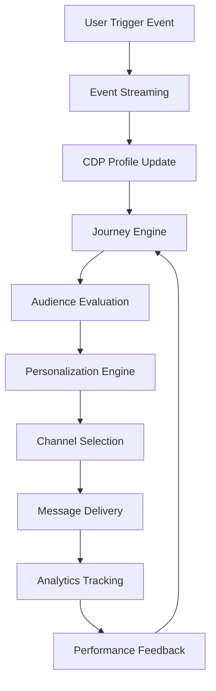
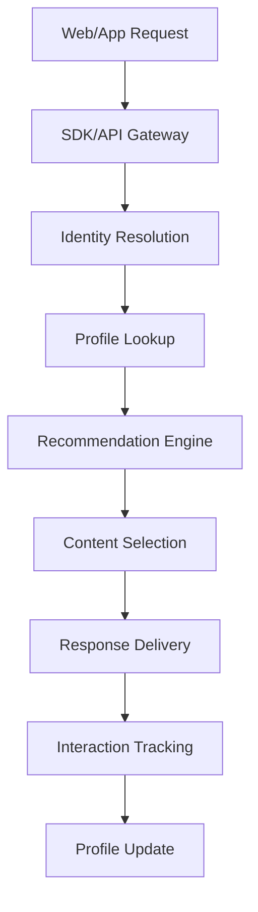
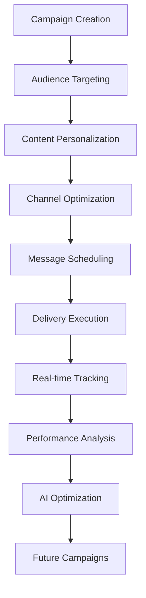

# Component Interaction Matrix - Netcore Cloud Platform

## Overview
This document maps the interactions, dependencies, and data flows between different components within the Netcore Cloud ecosystem. Understanding these relationships is crucial for impact analysis, testing, and troubleshooting.

## Core Architecture Components

### 1. Platform Services Layer

#### Customer Engagement (CE) Platform
- **Core Function**: Central orchestration engine for multi-channel marketing
- **Key Components**:
  - Journey Engine
  - Audience Manager
  - Campaign Orchestrator
  - Real-time Personalization Engine
  - Analytics & Reporting Engine

#### Communication Platform as a Service (CPaaS)
- **Core Function**: Programmable communication APIs and infrastructure
- **Key Components**:
  - SMS Gateway
  - Voice API
  - Email API (Pepipost)
  - WhatsApp Business API
  - RCS Gateway

#### Product Experience (PX)
- **Core Function**: In-app user experience optimization
- **Key Components**:
  - Nudge Engine
  - A/B Testing Framework
  - Feature Flag Manager
  - Analytics Dashboard
  - User Journey Tracker

### 2. Data Infrastructure Layer

#### Customer Data Platform (CDP)
- **Core Function**: Unified customer data management and activation
- **Key Components**:
  - Identity Resolution Service
  - Profile Management
  - Event Streaming
  - Data Lake Storage
  - Real-time Segmentation

#### Analytics & Intelligence
- **Core Function**: Data processing, insights, and AI/ML capabilities
- **Key Components**:
  - Co-Marketer AI Engine
  - Predictive Analytics
  - Recommendation Engine
  - Performance Analytics
  - Custom Dashboard Builder

### 3. Integration Layer

#### API Gateway
- **Core Function**: API management, security, and routing
- **Key Components**:
  - Authentication Service
  - Rate Limiting
  - API Versioning
  - Request Routing
  - Response Caching

#### SDK & Integration Hub
- **Core Function**: Client-side data collection and integration management
- **Key Components**:
  - Mobile SDKs (iOS/Android)
  - Web SDK
  - Server-side SDKs
  - Webhook Manager
  - Integration Marketplace

## Component Interaction Matrix

### High-Level Component Dependencies

| Component | Depends On | Provides To | Interaction Type |
|-----------|------------|-------------|------------------|
| Journey Engine | CDP, Analytics Engine | Channel APIs, PX Nudges | Real-time API calls |
| Audience Manager | CDP, Segmentation Service | Journey Engine, Campaigns | Data sync & queries |
| Campaign Orchestrator | Journey Engine, Channel APIs | Analytics Engine | Async messaging |
| Personalization Engine | CDP, Recommendation Engine | All Channels, Web SDK | Real-time API calls |
| Co-Marketer AI | Analytics Engine, CDP | Journey Engine, Campaigns | Batch & real-time |
| Channel APIs | Campaign Orchestrator | External Providers | API calls & webhooks |
| Event Streaming | SDKs, Webhooks | CDP, Analytics Engine | Real-time streaming |
| Identity Resolution | Event Streaming, APIs | CDP Profile Service | Data processing |

### Detailed Component Interactions

#### 1. Customer Journey Execution Flow



**Component Dependencies:**
- **Journey Engine** ↔ **CDP**: Real-time profile queries and updates
- **Journey Engine** ↔ **Audience Manager**: Dynamic segment evaluation
- **Journey Engine** ↔ **Personalization Engine**: Content personalization requests
- **Journey Engine** ↔ **Channel APIs**: Message delivery coordination
- **Journey Engine** ↔ **Analytics Engine**: Performance data collection

#### 2. Real-time Personalization Flow



**Component Dependencies:**
- **Web/Mobile SDK** ↔ **API Gateway**: Real-time API communication
- **API Gateway** ↔ **Identity Resolution**: User identification
- **Identity Resolution** ↔ **CDP**: Profile data retrieval
- **Recommendation Engine** ↔ **Analytics Engine**: Behavioral data analysis
- **Content Engine** ↔ **Campaign Manager**: Content template management

#### 3. Campaign Execution & Analytics Flow



**Component Dependencies:**
- **Campaign Manager** ↔ **Audience Manager**: Target audience definition
- **Campaign Manager** ↔ **Content Engine**: Template and content management
- **Campaign Manager** ↔ **Channel APIs**: Multi-channel delivery coordination
- **Analytics Engine** ↔ **All Channels**: Delivery and engagement tracking
- **Co-Marketer AI** ↔ **Analytics Engine**: Performance optimization insights

## Data Flow Patterns

### 1. Event Data Flow

| Source | Destination | Data Type | Frequency | Processing |
|--------|-------------|-----------|-----------|------------|
| Web SDK | Event Streaming | User actions, page views | Real-time | Schema validation |
| Mobile SDK | Event Streaming | App events, user behavior | Real-time | Batch processing |
| Email API | Analytics Engine | Delivery, opens, clicks | Real-time | Event aggregation |
| SMS Gateway | Analytics Engine | Delivery status, responses | Real-time | Status tracking |
| WhatsApp API | Analytics Engine | Message delivery, read receipts | Real-time | Webhook processing |

### 2. Profile Data Flow

| Source | Destination | Data Type | Frequency | Processing |
|--------|-------------|-----------|-----------|------------|
| CRM Systems | CDP | Customer attributes | Batch (daily) | Data normalization |
| E-commerce | CDP | Purchase history, preferences | Real-time | Profile enrichment |
| Event Streaming | CDP | Behavioral data | Real-time | Profile updates |
| Identity Resolution | CDP | Unified customer profiles | Real-time | Merge/deduplication |
| External APIs | CDP | Third-party data enrichment | Batch | Data validation |

### 3. Campaign Data Flow

| Source | Destination | Data Type | Frequency | Processing |
|--------|-------------|-----------|-----------|------------|
| Campaign Manager | Channel APIs | Message content, targeting | On-demand | Template processing |
| Journey Engine | Channel APIs | Automated messages | Real-time | Trigger-based |
| A/B Testing | Analytics Engine | Test variants, results | Real-time | Statistical analysis |
| Personalization | All Channels | Dynamic content | Real-time | Content rendering |

## Integration Points & APIs

### 1. Internal Service APIs

#### Journey Engine APIs
```
POST /journeys/{id}/trigger
GET /journeys/{id}/status
PUT /journeys/{id}/pause
DELETE /journeys/{id}/stop
```

#### Audience Manager APIs
```
POST /segments/create
GET /segments/{id}/members
PUT /segments/{id}/update
GET /segments/{id}/analytics
```

#### Personalization APIs
```
POST /personalize/content
GET /personalize/recommendations
PUT /personalize/rules
GET /personalize/performance
```

### 2. External Integration APIs

#### Customer Data Integration
```
POST /profiles/import
PUT /profiles/{id}/update
GET /profiles/{id}
DELETE /profiles/{id}/gdpr
```

#### Campaign Execution APIs
```
POST /campaigns/send
GET /campaigns/{id}/status
PUT /campaigns/{id}/pause
GET /campaigns/{id}/analytics
```

#### Analytics & Reporting APIs
```
GET /analytics/campaigns/{id}
GET /analytics/journeys/{id}
GET /analytics/segments/{id}
POST /analytics/custom-reports
```

## Cross-Component Dependencies

### 1. Critical Dependencies

#### High-Impact Dependencies (System-level failures)
- **Event Streaming** → **CDP**: Profile updates, behavioral tracking
- **CDP** → **Journey Engine**: Real-time profile access
- **Journey Engine** → **Channel APIs**: Message delivery
- **API Gateway** → **All Services**: Authentication, routing
- **Analytics Engine** → **All Components**: Performance tracking

#### Medium-Impact Dependencies (Feature-level failures)
- **Recommendation Engine** → **Personalization**: Product suggestions
- **Co-Marketer AI** → **Campaign Optimization**: AI insights
- **A/B Testing** → **Campaign Manager**: Test variant management
- **Identity Resolution** → **CDP**: Profile unification

### 2. Failure Impact Analysis

| Failed Component | Immediate Impact | Cascading Effects | Mitigation Strategy |
|------------------|------------------|-------------------|---------------------|
| Event Streaming | Real-time tracking stops | Profile updates delayed, personalization degraded | Queue events, batch processing |
| CDP | Profile access fails | Journey execution blocked, personalization fails | Cache frequently accessed profiles |
| Journey Engine | Automated campaigns stop | Revenue impact, customer experience degraded | Manual campaign fallback |
| Channel APIs | Message delivery fails | Campaign failure, customer communication blocked | Multi-vendor fallback |
| Analytics Engine | Reporting unavailable | Performance insights lost, optimization blocked | Cached reports, delayed processing |

### 3. Performance Dependencies

#### Latency-Sensitive Interactions
- **Real-time Personalization**: Web SDK → API Gateway → CDP → Recommendation Engine (< 100ms)
- **Journey Triggers**: Event → Journey Engine → Audience Evaluation → Action (< 500ms)
- **Campaign Send**: Campaign Manager → Audience → Personalization → Delivery (< 5 minutes)

#### Throughput Requirements
- **Event Ingestion**: 10,000+ events/second peak
- **Campaign Delivery**: 1M+ messages/hour peak
- **API Gateway**: 5,000+ requests/second sustained
- **Profile Queries**: 1,000+ lookups/second

## Testing Implications

### 1. Integration Testing Strategy

#### Component Interface Testing
- Test all API contracts between components
- Validate data format compatibility
- Verify error handling and timeout behavior
- Test authentication and authorization flows

#### End-to-End Flow Testing
- Complete customer journey execution
- Cross-channel campaign delivery
- Real-time personalization scenarios
- Analytics data accuracy validation

### 2. Failure Simulation Testing

#### Dependency Failure Testing
- Simulate component outages and measure impact
- Test graceful degradation scenarios
- Validate circuit breaker functionality
- Verify automatic recovery mechanisms

#### Performance Impact Testing
- Load test critical integration points
- Measure latency under various load conditions
- Test resource contention scenarios
- Validate scaling behavior

## Monitoring & Observability

### 1. Component Health Monitoring

#### Key Metrics per Component
- **API Response Times**: 95th percentile latency
- **Error Rates**: 4xx/5xx error percentages
- **Throughput**: Requests/messages per second
- **Resource Utilization**: CPU, memory, database connections

#### Cross-Component Metrics
- **End-to-End Latency**: Journey execution time
- **Data Consistency**: Profile synchronization lag
- **Campaign Performance**: Delivery success rates
- **Integration Health**: External API response times

### 2. Alerting Strategy

#### Critical Alerts (P0)
- Complete component failure
- Data corruption detected
- Security breach indicators
- Customer-facing service outage

#### Warning Alerts (P1)
- Performance degradation
- High error rates
- Resource exhaustion warnings
- Integration partner issues

### 3. Debugging & Troubleshooting

#### Distributed Tracing
- Trace requests across component boundaries
- Identify performance bottlenecks
- Correlate errors across services
- Analyze end-to-end transaction flows

#### Logging Strategy
- Structured logging with correlation IDs
- Component-specific log levels
- Error context preservation
- Performance timing logs

This component matrix serves as a foundational reference for understanding system architecture, planning testing strategies, and conducting root cause analysis during incidents. 